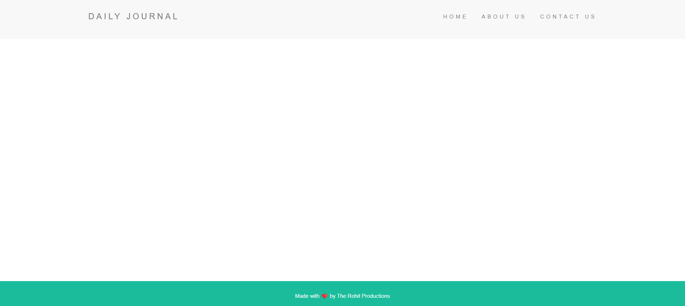
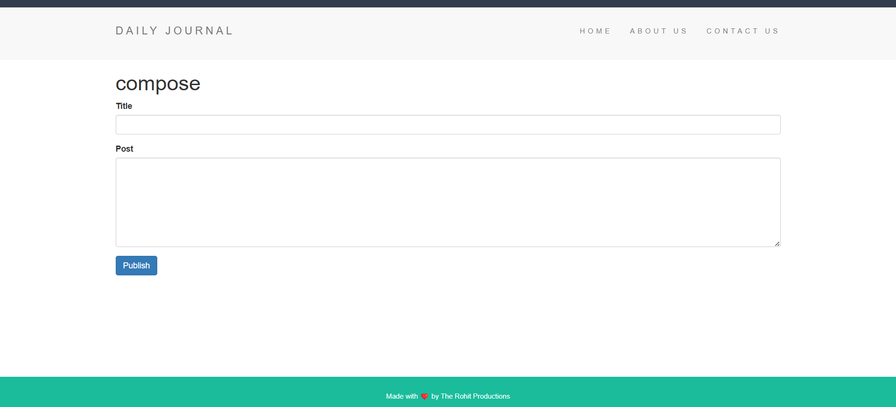

# 📔 Daily Journal App

A simple full-stack daily journal application built with **Node.js**, **Express**, **EJS**, and **MongoDB**. This app lets users compose, view, and manage journal entries with a clean and intuitive interface.

---

## ✨ Features

- Create and save daily journal entries
- View all past entries on the home page
- Dynamic routing to access individual entries
- Responsive and minimalist UI
- MongoDB-based persistent storage

---

## 📸 Demo Screenshots

Here are some demo images from the app (located in the `assets/` folder):

- **Homepage**

  

- **Compose Page**

  

## 🛠️ Getting Started

### 1. Clone the Repository

```bash
git clone https://github.com/rohitrao835589/daily-Journal-app.git
cd To-Do-list-complete-app
```

### 2. Install Dependencies

```bash
npm install
```

### 3. Configure Environment

Create a `.env` file in the root directory and add your MongoDB URI:

```env
MONGODB_URI=your_mongodb_connection_string
```

### 4. Run the App

```bash
npm start
```

Open [http://localhost:3000](http://localhost:3000) in your browser.

---

## 📁 Folder Structure

```
├── assets/             # Demo images
├── views/              # EJS templates
├── public/             # Static assets (CSS, images, etc.)
├── node_modules/
├── app.js              # Main Express application
├── .env                # Environment variables
├── package.json
└── README.md
